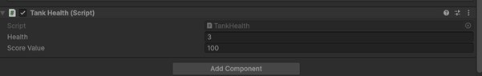
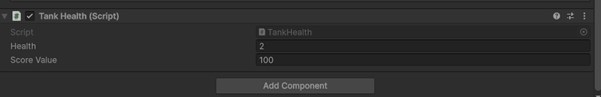
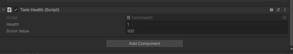
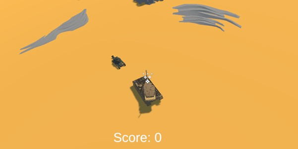
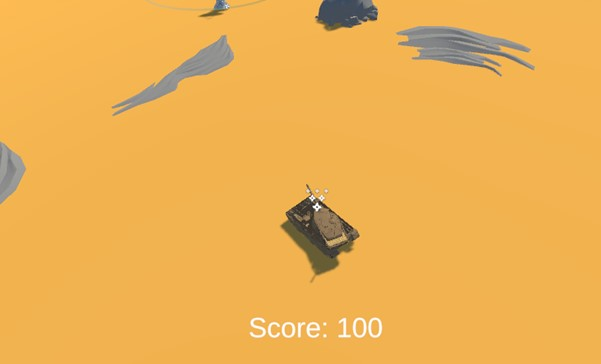

# DH2323 Project Blog

## Project Title
Extension of Unity Tank Game

## Description
This project extends the DH2323 Unity tank lab by adding simple gameplay features such as:
- Health system
- Enemy behaviour improvement (enemy stops when near player)
- Score system

## Progress
Week 1: Set up Lab 3 Unity tank scene from DH2323 and implemented enemy health system and shell damage.

Week 2: Modified enemy movement so enemies stop near the player, and implemented score system and UI (TextMeshPro).

Week 3: Wrote project report and prepared submission.

## Screenshots
Health system:

Enemies behaviour:

Score UI:

